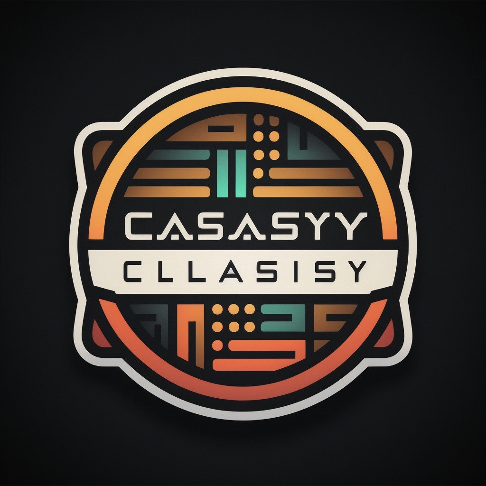

## <p align="center">CodeClassify</p>

[](https://discord.gg/UDNcTrBagN)
[](https://twitter.com/vkxni)
[](https://github.com/alelievr/Mixture/blob/master/LICENSE)

<p align="center">
    </img>
</p>

<p align="center"> 
<strong>
Guess programming languages on Discord. 
</strong>
</p>

### Get started
Follow these simple steps to start guessing: 

- Invite Classify to your server: [https://discord.com/api/oauth2/authorize?client_id=779694650730086411&permissions=2147830784&scope=bot%20applications.commands](https://discord.com/api/oauth2/authorize?client_id=779694650730086411&permissions=2147830784&scope=bot%20applications.commands)

- Run the `/panel` command

Have fun!

---

#### Privacy
Simple playing does nothing, but once you win (guess correctly), we store your success somewhere deep in the woods. Not even the magic raindeers can see your private data, you have the full power. 

Public leaderboard; Yes, everyone has the chance to get on there, simply play and try to guess as many languages as possible. If you want to leave the leaderboard completely, run `/reset`. This will delete all of your saved data.

We only save your public Discord ID and the amount of guesses (wins) you have/had. 

---

# Faq
> #### Can I add my own code?
Yes you can, simply open a PR that adds the given code to the `data/<language>` folder. Make sure to include it in the `src/structures/FilePaths.ts` file too (if it doesn't exist yet)

> #### How many languages are supported?
A few, many, it depends. I try to support as many as possible, but it is hard to keep up with all the languages. If you want to add your own, please read the previous question.

> #### Can I download the Code and use it on my own bot?
No. I wont help you with it, invite it and use it the basic way. 

> #### How do you detect/guess languages correctly?

Lets take a look at some languages and how you can differentiate them.

Python; is well known and popular for its special "import" syntax (from A import B).

```py
from time import sleep
# or import time

a = 10
sleep(4)
print(a)
```

Java; while "package" isnt unique, the System.XYZ pretty much is. Oh, and the `System<...>`

```java
package org.example;

import net.dv8tion.jda.api.JDABuilder;

 public static void main(String[] args) {
        // ...

        try {
            // ...
        } catch (LoginException | InterruptedException e) {
            System.err.println("Couldn't do this.");
            e.printStackTrace();
        }
    }
```

Kotlin; moving on with "package", you pretty much know that we are in the JVM-language family (Kotlin, Scala, Java, Groovy). But Kotlin is known for his `fun` keyword (stands for function), and for declaring immutable variables with `val`
```kt
package template

val name = "John"
fun main() {
    println(name)
}
```

Scala; Scala could be a bit harder, but its definitely doable. Since Scala is functional, it doesnt use `classes`, instead `objects`

```scala
package science.wasabi.tini.bot

import scala.collection.immutable.Iterable

object BotMain extends App {
  println(Helper.greeting)
}
```

JavaScript; JavaScript is very easy, due to its `console.log` and `require` imports.
```js
const someFile = require("from/here.txt");

var XYZ = "hi there";
const cool = 123;

console.log(someFile);
```

C#; C# cool and very easy to guess. Its known for its `using` keyword, and for its `class` keyword (OOP).

```cs
using System;

namespace ConsoleApp1
{
    class Program
    {
        static void Main(string[] args)
        {
            Console.WriteLine("Hello World!");
        }
    }
}
```

C++; C++ kinda has an unique syntax too, same as C, we use `#include` imports and `std` for the main library. 

```cpp
#include <iostream>

int main() {
    int arr[3] = {1, 2, 3}
    for (int i = 0; i < 3; i++) {
        std::cout << arr[i] << std::endl;
    }
}
```

C; C is close, but really isnt too close to C++, main difference: instead of `std::cout` we use `printf` to print to the console.

```c
#include <stdio.h>

int main() {
    int arr[3] = {1, 2, 3}
    for (int i = 0; i < 3; i++) {
        printf("%d\n", arr[i]);
    }
}
```

Haskell; Haskell is a bit harder, but also doable. Haskell is also a functional language, it doesnt use `classes`, instead it uses `data` and `type` keywords. We also see the special import with `module XYZ where ...`

```hs
module Main where

data Person = Person { name :: String, age :: Int }

main :: IO ()
main = do
  let p = Person { name = "John", age = 20 }
  putStrLn $ "Hello, " ++ name p ++ "!"
```

PHP; PHP is known for its `<?php` and `?>` tags, most of the time within HTML tags. Printing looks the same as Bash does, with "echo".

```php
<php
    echo "Hello World!";
?>
```

Ruby; Ruby is known for its `class` keyword, and for its `def` keyword (stands for function). It also uses `require` to import modules.

```rb
# some random import
require 'date'

class Person
  def initialize(name)
    @name = name
  end

  def greet
    puts "Hello, my name is #{@name}"
  end
end
``` 

Elixir; Ruby inspired Elixir - thats why they are a bit similar. Elixir though, has a unique `(def)module` system.

```elixir
defmodule Main do 
    def print() do 
        IO.puts("Hi there")
    end
end
``` 

Rust; Rust has a very *different* syntax, easier for us though! Functions are short, monads exist. 

```rs
use std::collections::hash_map::{self, HashMap};

fn foo<T>(_: T){}
fn bar(map1: HashMap<String, usize>, map2: hash_map::HashMap<String, usize>){}

fn main() {
    // ...
}
``` 

more soon ...